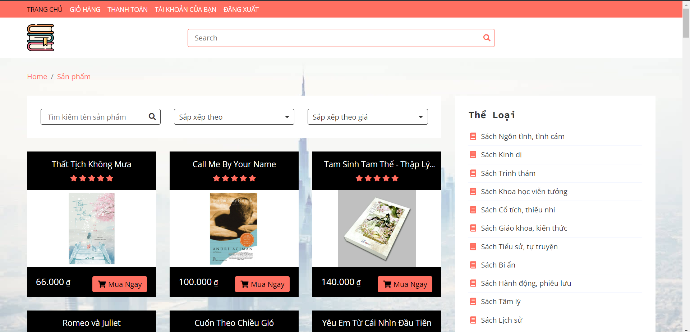
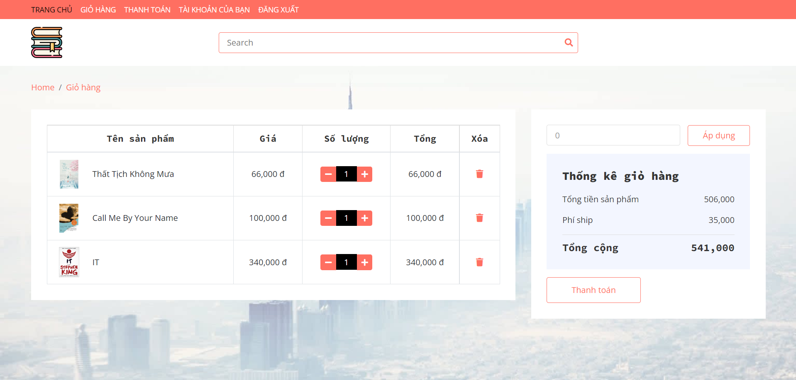
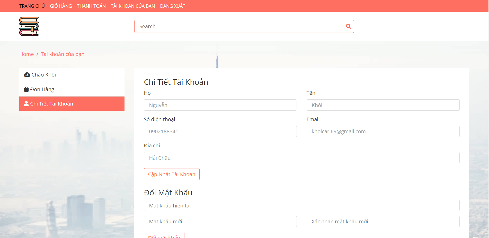
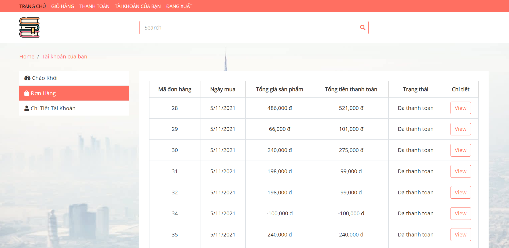
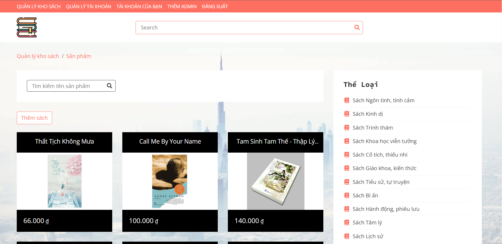
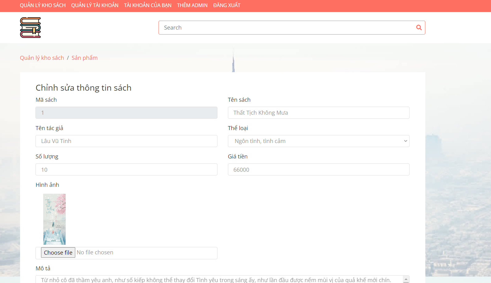
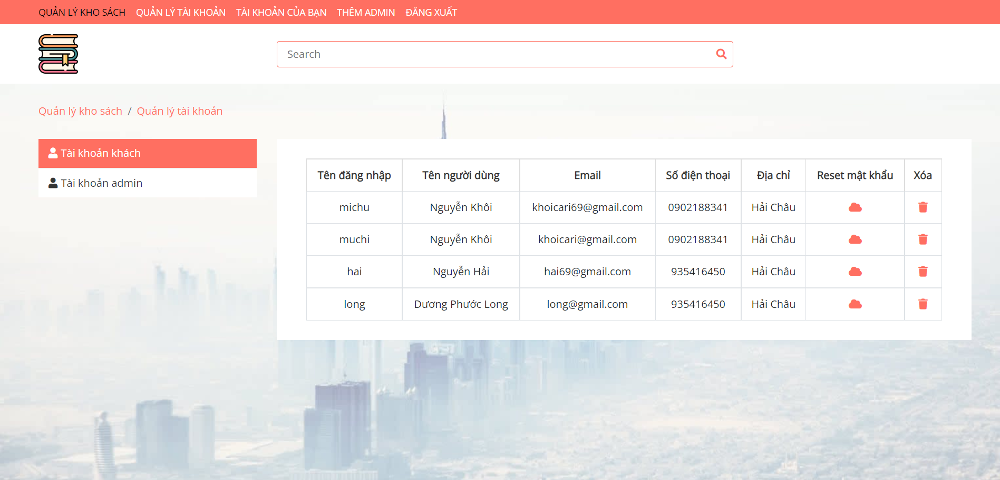

# PBL_Bookmanagement
# NodeJS Bookmanagement - NodeJS, Express, Express Ejs

BookManagement is an web app that will help bookstore to sell book and Manage Staff, Customer database, bookstore database

# Usage
There are some screenshots about this app, and the sequence of using the app.

**1. Login**

**2. Homepage Customer**

**3. Shopping Cart**

**4. Information of Customer**

**5. Admin Page**

**6. Book Detail**

**7. Database of Staff and Admin**

